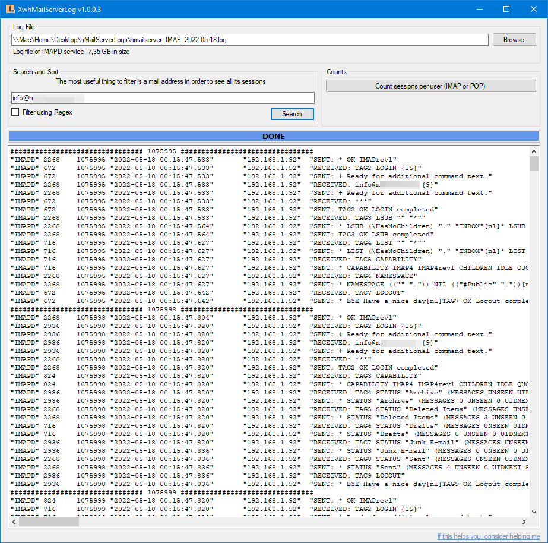
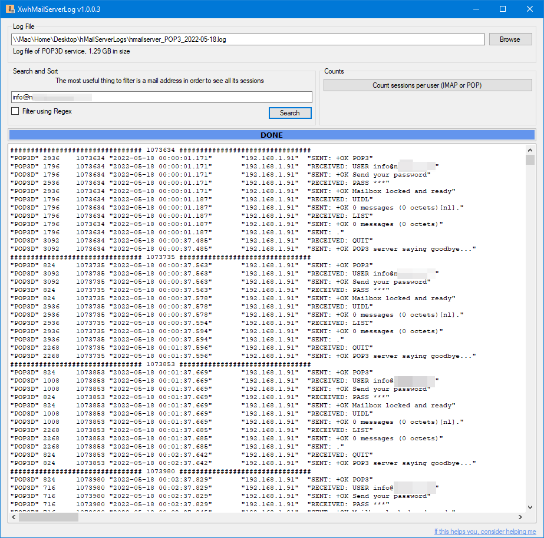
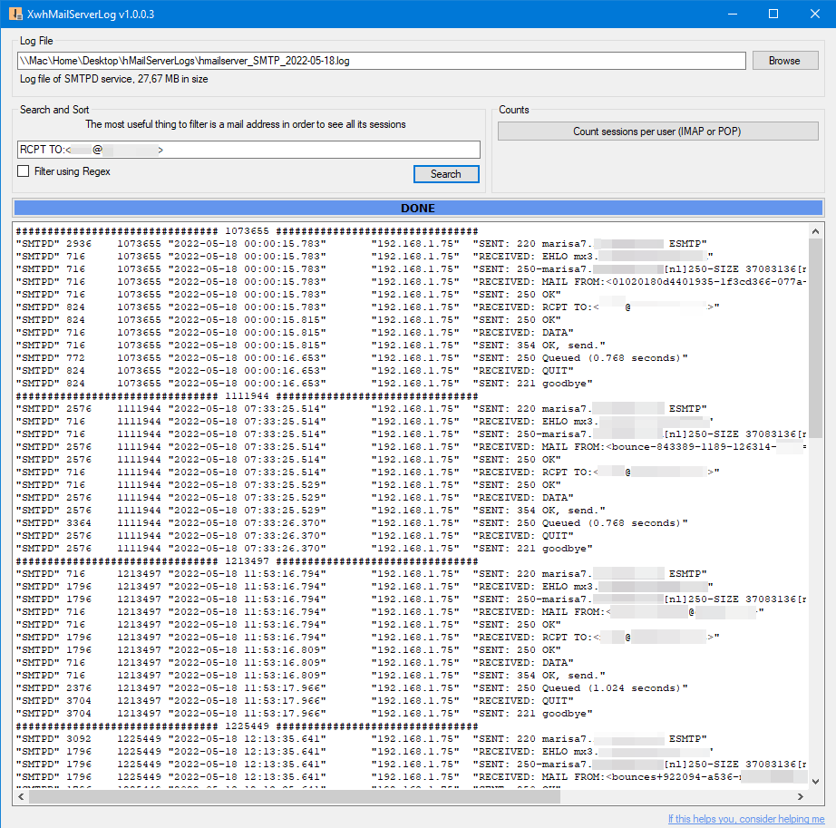
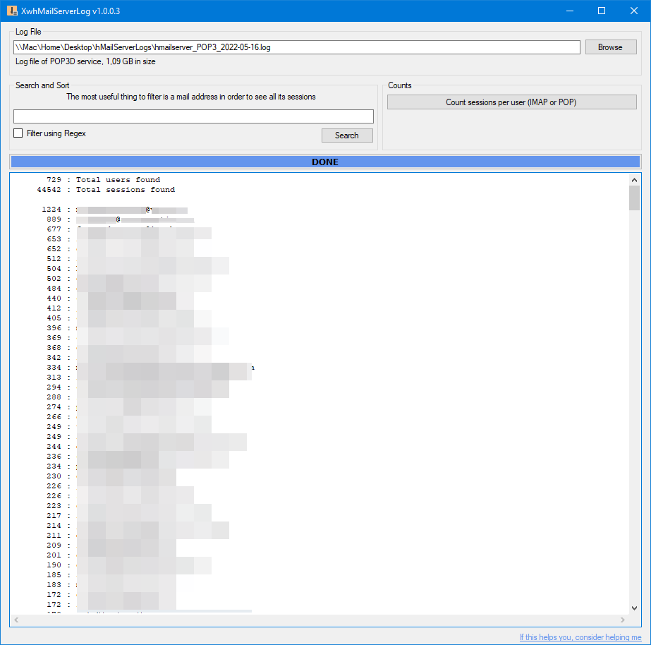

# XwhMailServerLog

A hMailServer Log parser

Searching multi-gigabyte log files is prety much impossible with a text editor.

This small app allows you to:
- Search log big log files 
- Order the command by session so that sessions don't appear all mixed up
- Count number os sessions per user  
     
  

  
  
  
  

## In case you are feeling generous  
